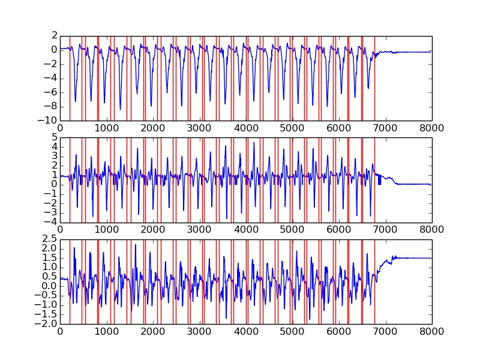
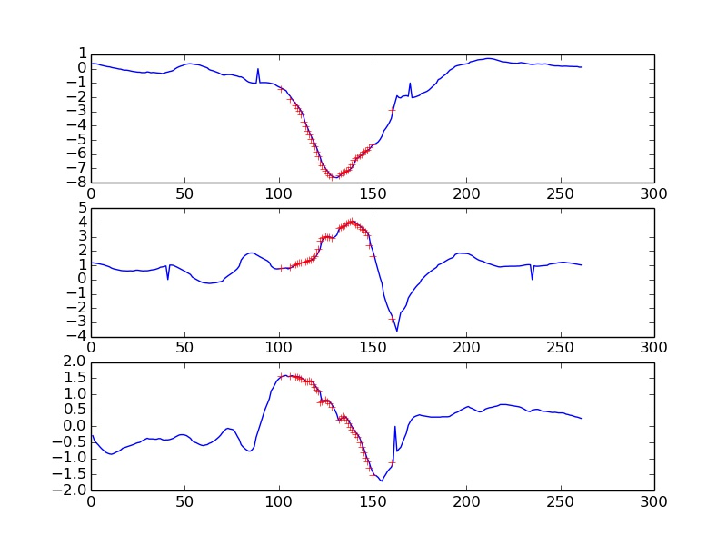

# Data preprocessing code for CoachT

This code is used for preprocessing data to be used by [Coacht_api](https://github.com/Eskender-B/coacht_api)

The preprocessing is done in the following order:

1. Initial CSV stream of data containing acceleration reading, (ax, ay, az), are located in the respective groups in the top directory.

2. [slice.py](slice.py) is used to slice a CSV file containing swing records into single swings
 The slicing is done based on command line parameters threshold and width and finding the peak point 
 of ax among vector acceleration data of (ax, ay, az) specific for the direction setup used when
 collecting the data. 
 This is all experimental and not gaurentied to work always. So you need to see the final plot result
 and do the slicing again with different parameters until you are satisfied.

	* threshold:  minimum value above which maximum is detected
	* width:      the value in number of points to the right and left of the maximum point marking
		      the begining and end of a single swing

3. [sample.py](sample.py) is used to sample the swings generated above so that each swing is made up of
   42 vector points (ax, ay, az) so that 42x3 = 126 features are used in keeping up with the constraint of
   128 supported by the chip. The sample points are found out by analyzing the training dataset as a whole and
   choosing 42 points such that points around maximum variations are considered.

4. [get_sample_index.py](get_sample_index.py) prints the sample indexs by considering the whole dataset
   not just the training set useful for final model training.

## Data Organization
* Initial CSV stream of data containing acceleration reading, (ax, ay, az), are located in the respective groups in the top directory.

* After slicing data is found at [sliced/](sliced/)
* To see how well you sliced see the picture in the corresponding folder.
* Here is one example: a swing is located between two red lines 
* After sampling sampled data is found [sampled/](sampled/)
* To see plot result of sampled data see [sampled/figure/](sampled/figure/)
* Here is one example: sampled points are shown in red cross 
* Final Result is at [sampled/data/](sampled/data/)

## To Do
* Need to come up with a better way of identifying swings.
* The sample indexs are fixed and copied over to the library implementation. (Need to come up with a more general way)

